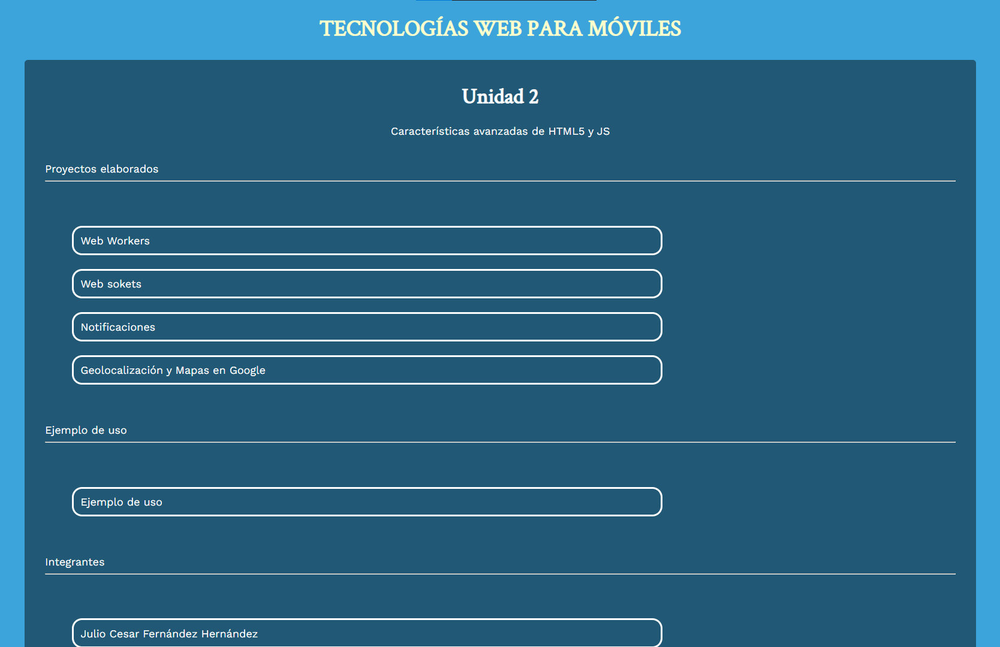

# TECNOLOGIAS WEB PARA MOVILES
## Unidad 2 

Realizar un sitio web donde se incluyan todos los temas vistos en la unidad dos (Geolocalización, Web workers, Web sockets, Mapas en Google, Notificaciones) y realizar una aplicación donde se incluyan todos los elementos en conjunto.

## Comandos necesarios para iniciar el proyecto desde node

Descargar proyecto
```
git clone https://github.com/Juli0-Cesar/TecWebMovilesU2.git
```

Instalar modulos de node nesesarios para funcionar:
```
npm install
```
Iniciar proyecto:

```
npm start
```
O tambien se puede usar:
```
npm index.js
```
[Abrir el siguiente link en el navegador](http://localhost:3000)

